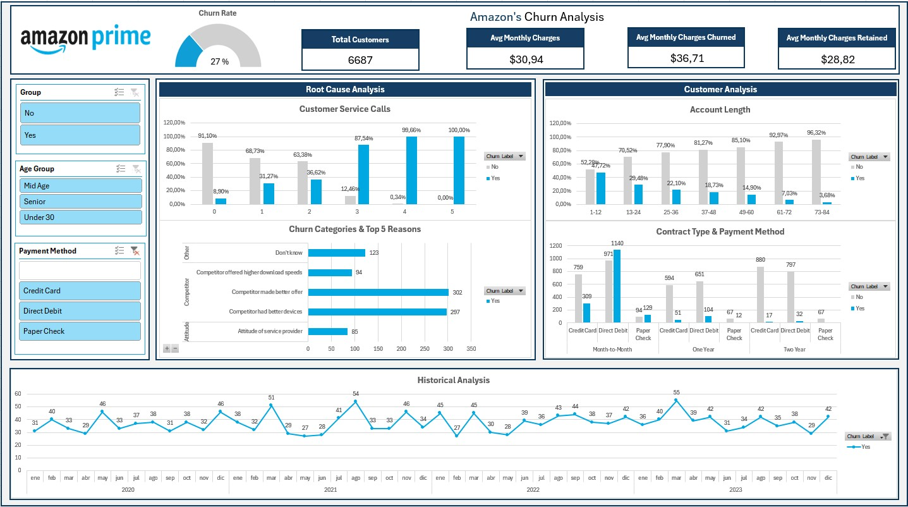

# 📊 Análisis de la Tasa de abandono (Churn) - Amazon Prime

## 📌 Objetivo

Este proyecto tiene como objetivo analizar la tasa de abandono (_churn_) de clientes de una suscripción tipo Amazon Prime. El análisis de _churn_ busca identificar patrones y factores que contribuyen al abandono de clientes.

Utilizando datos históricos y mostrando los resultados en un dashboard interactivo con métricas clave, análisis descriptivos y gráficos, nos ayudaran a comprender las causas de la pérdida de clientes, lo que permitirá una mejor toma de decisiones estratégicas y operativas.


---
## 🗂️ Estructura del Proyecto


```bash
Amazonprime_Dashboard_Excel/

├── Dashboard/
├── Data/
│   ├── Data_raw/
│   │   └── amazon_churn_datosbrutos.xlsx
│   ├── Data_transformed/
│   │   └── amazon_churn_datostransformados.xlsx
│   ├── Data_analysis/
│   │   ├── amazon_churn_analisis_descriptivo_num.xlsx
│   │   ├── amazon_churn_analisis_descriptivo_cat.xlsx
│   ├── Data_dashboard/
│   │   └── amazon_churn_dashboard.xlsx
├── Images/
├── Notebook/
    ├── 1_Pre_analisis.ipynb
    ├── 2_Limpieza_y_Transformación.ipynb
    ├── 3_EDA.ipynb
    └── 4_Dashboard.ipynb

```
## 📄 Descripción de las Variables

- **Customer ID** *(str)*: Identificador único del cliente.

- **Churn Label** *(str)*: Variable categórica, etiqueta tipo Sí/No que indica si el suscriptor ha cancelado la suscripción o no.

- **Churned** *(bool)*: Variable vinaria,`1` si el suscriptor canceló la suscripción, `0` si continúa suscrito.

- **Account Length (in months)** *(int)*: Duración de la cuenta actual o más reciente del suscriptor, en meses.

- **Customer Service Calls** *(int)*: Número de llamadas realizadas al servicio de atención al cliente.

- **Avg Monthly GB Download** *(int)*: Promedio de GB descargados al mes.

- **Unlimited Data Plan** *(bool)*: `1` si el cliente tiene plan de datos ilimitado, `0` si tiene un plan limitado.

- **Extra Data Charges** *(int)*: Pagos adicionales por almacenamiento de datos extra (en USD).

- **State** *(str)*: Abreviación del estado de residencia del cliente (EE. UU.).

- **Phone Number***(str)*: Número de teléfono del cliente.

- **Gender** *(str)*: Género del cliente.

- **Age** *(int)*: Edad del cliente.

- **Under30** *(str)*: Variable binaria, etiqueta tipo Sí/No que indica si el cliente es menor de 30 años.

- **Senior** *(str)*: Variable binaria, etiqueta tipo Sí/No que indica si el cliente tiene 65 años o más.

- **Group** *(str)*: etiqueta tipo Sí/No que indica si el cliente pertenece a un plan de suscripción familiar.

- **Number of Customers in Group** *(int)*: Número de clientes incluidos en el plan familiar.

- **Device Protection & Online Backup** *(str)*: Etiqueta tipo Sí/No que indica si la suscripción incluye protección de dispositivo y respaldo en línea.

- **Contract Type** *(str)*: Tipo de contrato según el período de suscripción (mensual, anual, etc.).

- **Payment Method** *(str)*: Método de pago utilizado por el cliente para el último período de suscripción.

- **Monthly Charge** *(int)*: Pago mensual del cliente por la suscripción (en USD).

- **Total Charges** *(int)*: Monto total que se ha cobrado a cada suscriptor desde el inicio del período de suscripción.

- **Churn category** *(str)*: categoría del motivo de cancelación de la suscripción.

- **Churn Reason** *(str)*: Razón específica de la cancelación de la suscripción.

- **Contact Date** *(date)*: Fecha del último contacto.

- **Last Transaction Date** *(date)*: Fecha del último pago realizado.

- **Customer Tenure (in months)** *(int)*: Tiempo transcurrido desde la primera suscripción, en meses.(Tiempo de permanencia del cliente).

- **Customer Segment** *(str)*: tipo de clasificación del cliente (por ejemplo: alto, medio o bajo).

- **Average Monthly Expenses** *(float)*: gasto promedio mensual del suscriptor.

- **Number of Complaints or Support** *(int)*: número de veces que el cliente emitió una queja o solicitud de soporte.

- **Preferred Contact Method** *(str)*: método de contacto preferido del cliente.

- **Applied Discount** *(str)*: indica si se ha aplicado un descuento (**VERDADERO**) o no (**FALSO**).

- **Favorite TV show** *(str)*: programa de televisión favorito del cliente.

- **Internal Notes** *(str)*: Notas internas.

## 🧪 Desarrollo del Proyecto

#### 1. Preanálisis
Identificación del tipo de datos e inconsistencias. (Ver Notebook -> 1_Pre-analisis.ipnyb).

#### 2. Limpieza y Transformación de Datos
Se descartan filas duplicadas y columnas irrelevantes que no eran de interés para el análisis. Se normalizan los datos (mismo idioma, mayúsculas y minúsculas, etc.) (Ver Notebook -> 2_Limpieza_y_Transformación.ipynb).

#### 3. Análisis Exploratorio de Datos (EDA):
Se examinan los datos utilizando resúmenes estadísticos descriptivos, tablas dinámicas y gráficos dinámicos para extraer información valiosa. Este paso incluye análisis univariado y bivariado en columnas numéricas, categóricas y de fecha. (Ver Notebook -> 3_EDA.ipnyb).

#### 4. Dashboard
Se crea un panel interactivo con los Indicadores Clave de Rendimiento (KPI) y las visualizaciones más detalladas. (Ver Notebook -> 4_Dashboard.ipnyb).

## 📈 Conclusiones

1. La tasa general de abandono aumentó al 27 % entre enero de 2020 y diciembre de 2023.

2. A los suscriptores que abandonaron la suscripción se les cobró casi un 5 % más al mes que el promedio.

3. Una vez que el cliente llama al servicio por tercera vez, la probabilidad de cancelar es mayor que la de mantener la suscripción, alcanzando casi el 90 % y aumentando con las llamadas posteriores.

4. Las principales razones de la pérdida de clientes son la mejor oferta de productos de la competencia y la buena atención al cliente.

5. La pérdida de clientes se reduce en un 20 % después de un año de suscripción y continúa disminuyendo hasta valores insignificantes a medida que la cuenta se prolonga.

6. Los contratos mensuales favorecen significativamente la cancelación de la suscripción en comparación con los contratos anuales. Además, los suscriptores con un contrato mensual tienen más probabilidad de abandonar la plataforma que de permanecer suscritos cuando pagan con domiciliación bancaria o tarjeta de débito

7. Durante el período analizado, agosto siempre ha sido un mes con muchas cancelaciones. Sin embargo, sorprendentemente, desde 2021, marzo también ha mostrado un comportamiento similar, siendo el mes con las tasas de abandono más altas en 2021 y 2023.
---

## 🤝 Contribuciones

Las contribuciones a este proyecto son bienvenidas.

## 📊 Dashboard

